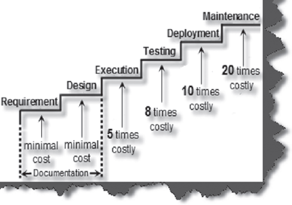

# Flutter Testing Guide

## Introduction

Tests are an essential part of software development. They help developers to verify the functionality of the code they write and ensure that it behaves as expected. Testing is a process of executing a program with the intent of finding errors. In Flutter, testing is an essential part of the development process, and it's critical to write high-quality tests that cover all corner cases.

## Why do we need tests?

Tests ensure that the code you write works as intended. They help to catch bugs early in the development process, which saves time and effort in the long run. Writing tests also makes the code more reliable and maintainable. The cost of removing defects increases exponentially. A defect caught in requirement and design phase costs less to fix than an error caught in the software maintenance cycle.

## How to cover all the corner cases?

To ensure that your tests cover all corner cases, you should consider the different input values and edge cases that your code might encounter. For example, if you are testing a function that performs a calculation, you should test it with different input values, including negative numbers, zero, and large numbers.
